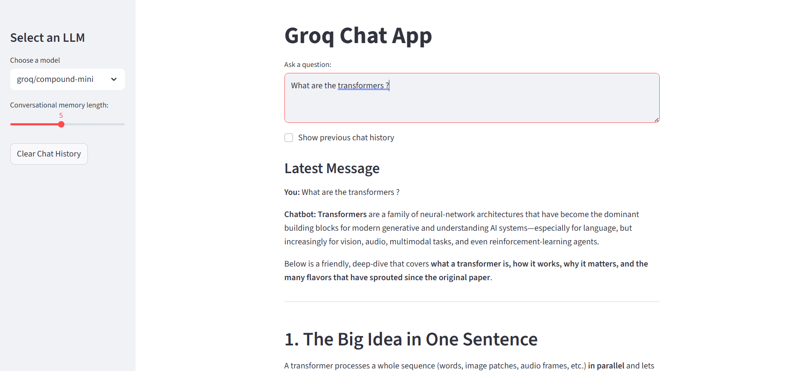

# 🤖 Chat Assistant - Gen AI Project

A simple conversational chat assistant built with [Streamlit](https://streamlit.io/) and [LangChain](https://www.langchain.com/) using the free [Groq API](https://groq.com/).  
Select different LLM models, control conversational memory, and chat interactively.

## 🖼️ Chat UI Preview



## Features

- Choose from multiple Groq-supported LLMs
- Adjustable conversational memory window
- Chat history management (view, clear, toggle previous messages)
- Simple, responsive Streamlit UI

## Setup

### 1. Clone the repository

```bash
git clone https://github.com/sanchit-yadav/Simple-Chat-assistant-with-GROQ.git
cd groq-chat-assistant
```

### 2. Install dependencies

```bash
pip install -r requirements.txt
```

### 3. Get your Groq API key

- Sign up at [Groq](https://groq.com/) and get your free API key.

### 4. Create a `.env` file

Add your API key to a `.env` file in the project root:

```
GROQ_API_KEY=your_groq_api_key_here
```

### 5. Run the app

```bash
streamlit run app.py
```

## Usage

- Select your preferred LLM model from the sidebar.
- Adjust the conversational memory length.
- Type your question and interact with the assistant.
- Use the "Clear Chat History" button to reset the conversation.
- Toggle "Show previous chat history" to view earlier messages.

## File Structure

chat-assistant-groq/
├── app.py             # Streamlit UI
├── main.py            # API wrapper for Groq
├── config.py          # Model config
├── .env               # Your API key
├── requirements.txt   # Python dependencies
├── README.md          # This file
└── screenshots/
    └── chat_ui.png    # Example screenshot

## Dependencies

- streamlit
- langchain
- langchain_groq
- python-dotenv

## License

MIT License

---

**Note:**  
This project is for educational/demo purposes.  
For production use, secure your API keys and follow best practices.